# Mobile Application Assessment (MAA) Virtual Testing Environment Setup

# Introduction

Setting up a mobile testing environment is not a trivial task when your first MAA project is ready to start tomorrow (as was my case). It requires several pieces of software interacting together to cover a complete MAA methodology while we should be able to save evidences and output records.

This playbook shows a few ways to configure a mobile testing environment from scratch in compliance with the Bishop Fox’s standards and tools. Choose the best option depending on your resources and requirements.

>💡 **Note:** The setup options that include WSL are highly recommended since they require less steps and could save you some time

# Basic requirements

This tutorial assumes that you are working on Windows 10 and you have already installed the following software, depending on the setup option you choose:

- BurpSuite Professional
- MobaXterm
- OpenVPN 2.5.9 or lower (Refer to this page to download the right version: [https://build.openvpn.net/downloads/releases/OpenVPN-2.5.9-I601-amd64.msi](https://build.openvpn.net/downloads/releases/OpenVPN-2.5.9-I601-amd64.msi))
- Genymotion (with VirtualBox)
- Windows Subsystem for Linux (WSL) version 1 ([https://learn.microsoft.com/en-us/windows/wsl/install-manual](https://learn.microsoft.com/en-us/windows/wsl/install-manual))
- OpenSSL (installed in the Kali box)

You should also have access to the following services:

- Bishop Fox’s Corellium instance
- Kali box instance deployed

# iOS

## Setup 1 - iOS Device In Corellium + Frida & Objection In Kali Box + Burp & MobaXterm In Local Windows

### Configuration Diagram

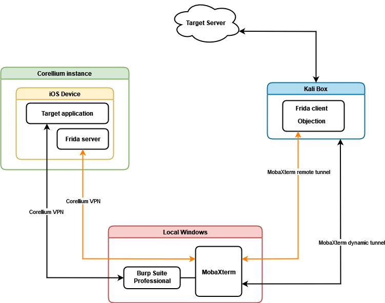

In this setup option we will have three main components: the Corellium instance, our local Windows host and the Kali box. The Corellium instance will host an iOS device that contains the target application and the Frida server necessary for some actions such as bypassing SSL pinning and extracting the memory dump. The local Windows host will be running the Burp Suite proxy to intercept the application’s traffic and MobaXterm to establish SSH tunnels to and from the Kali box. Finally, the Kali box will route all the traffic to the target’s backend in the Internet and also will host the Frida client and Objection to interact with the iOS device.

Two main connection types will be used: Corellium VPN between the iOS device and our Windows host and MobaXterm SSH tunnels between our Windows host and the Kali box.

### Configuration Steps

1. Create a new iOS device in your Corellium instance and select `iPhone 11 Pro Max`, version `14.2 (Build 18B92)`

Corellium will take a few minutes to complete the creation of the new device. Meanwhile we can start configuring our proxy

1. Create/open a typical Burp project
2. Create new proxy listener for the iOS device. In the Burp *Proxy* tab click on *Proxy Settings > Proxy Listeners > Add* and add the following listener:
    - `Bind port: 8082`
    - Mark the `All interfaces` check box
    
    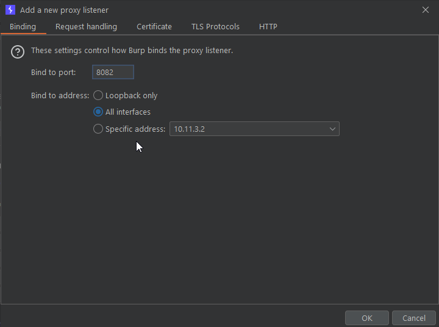
    
3. Since the client has to be able to identify our network traffic, we have to route the Burp traffic to the application’s backend through the Kali box. In the Burp *Settings* window click on *Network > Connections > SOCKS proxy* and add the following proxy:
    - `SOCKS proxy host: 127.0.0.1`
    - `SOCKS proxy port: 9090`
    - Mark the `Use SOCKS proxy` check box
    
    
    
4. Open MobaXterm and create a new SSH tunnel for the Burp traffic in the Kali box. Click on *Tunneling > New SSH tunnel > Dynamic Port Forwarding (SOCKS Proxy)* and set the following parameters:
    - `Forwarded port: 9090`
    - `SSH server: <Your Kali box address>.bf.run`
    - `SSH login: kali`
    - `SSH port: 22`
    
    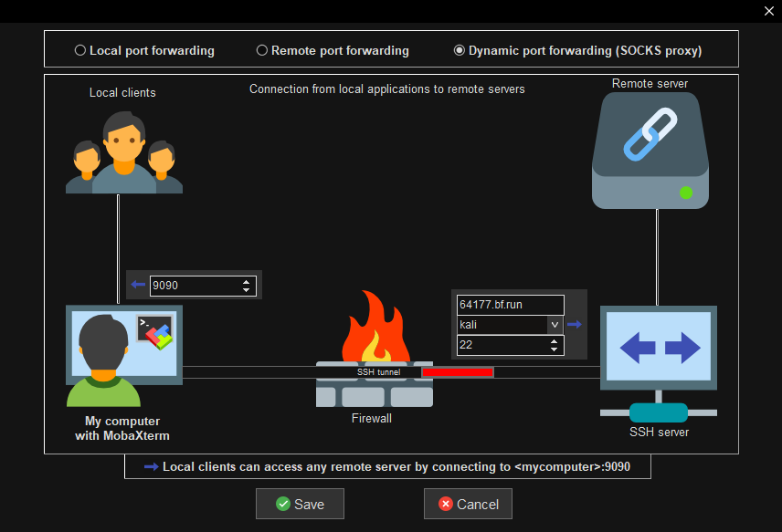
    
5. Save and start the tunnel
6. Once the iOS device is created and running. Go to the Corellium ********Connect******** section and download the *****OVPN file*****
    
    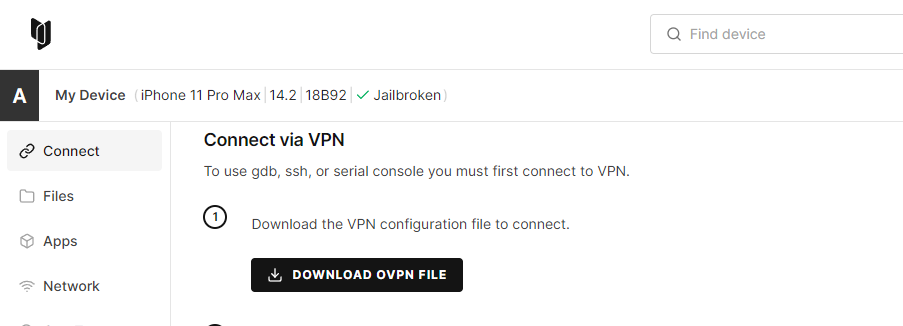
    
7. Import the *****OVPN file***** in OpenVPN and connect to the Corellium VPN profile
    
    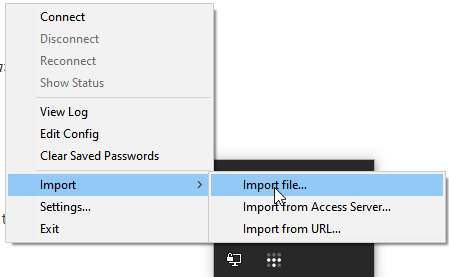
    
8. Open a CMD window and type `ipconfig` to obtain the IP address of your local Windows host within the Corellium VPN range. It must be something like `10.11.3.2`
    
    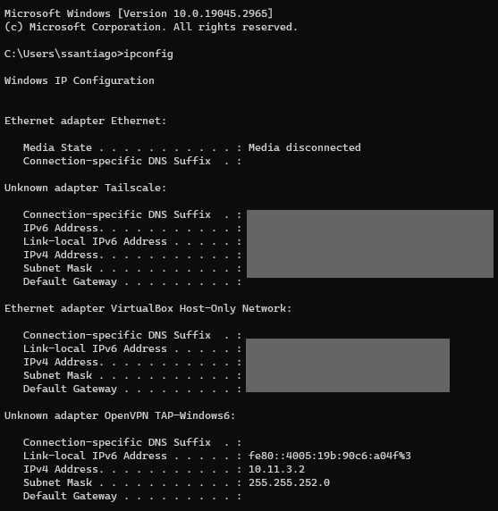
    
9. In the iOS device go to ********************Settings > Wi-Fi >******************** tap on **i** icon of the Corellium network ***********> Configure > Proxy > Manual*********** and set the following parameters:
    - `Server: <IP address obtained in step 9>`
    - `Port: 8082`
    
    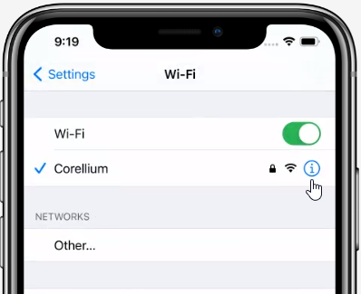
    
    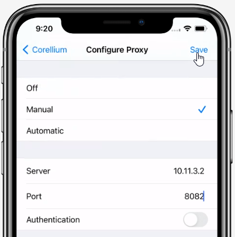
    
10. Open the Safari browser in the iOS device and go to `http://burp`. Then tap on **********************CA Certificate > Allow**********************
    
    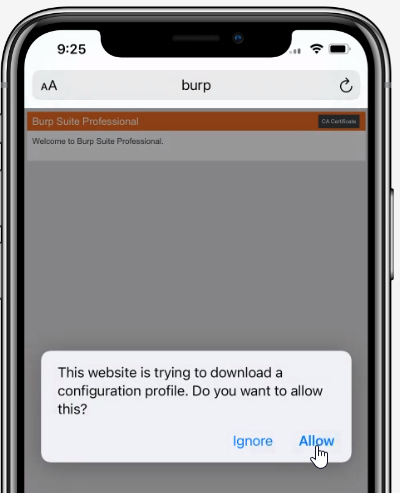
    
11. Go to ********************************************************************************Settings > Profile Downloaded > PortSwigger CA > Install > Install > Install > Done********************************************************************************
    
    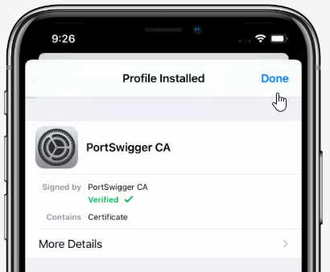
    
12. Go to *Settings > General > About > Certificate Trust Settings > Enable PortSwiggerCA*. Now, the iOS device has internet access and the proxy configured
    
    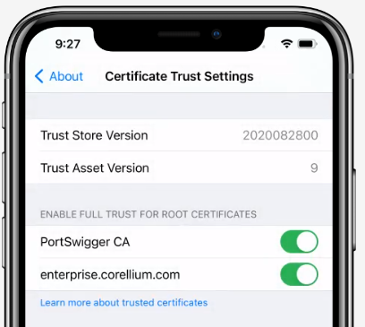
    

At this point we have configured Burp and the device proxy. You can test it by browsing `wikipedia.org` in Safari and intercepting the traffic in Burp. Now we have to configure Frida and the Kali box. By default, a Frida server is running in the port 27042 of the iOS device. However, we need to create a port forwarding entry in the Corellium’s console to enable network access. We also need to create a second SSH tunnel to communicate our Kali box with the Frida server

1. In Corellium go to *Port Forwarding > Add Port* and create the following entry:
    - `Device port: 27042`
    - `Router port: 27042`
    
    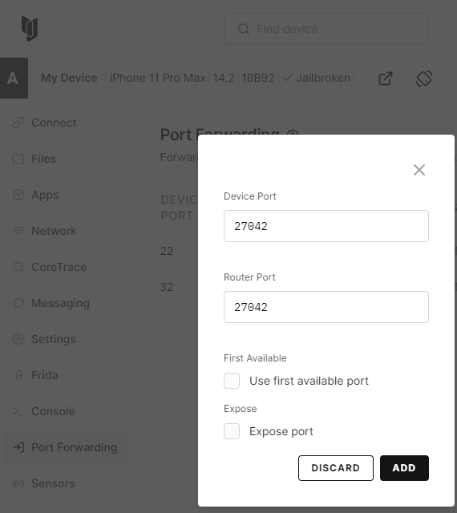
    
2. Grab the IP address of your iOS device in the Corellium ***************Connect > IP Connectiviy > Services IP*************** section
    
    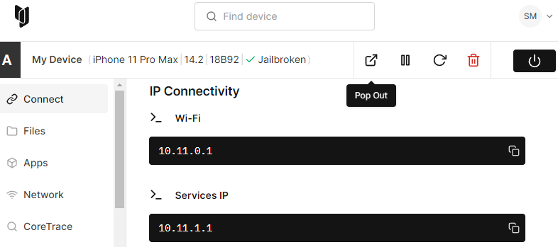
    
3. In MobaXterm click on *Tunneling > New SSH tunnel > Remote Port Forwarding* and configure the following tunnel:
    - `Forwarded port: 8888`
    - `SSH server: <Your Kali box address>.bf.run`
    - `SSH login: kali`
    - `SSH port: 22`
    - `Local server: <IP address of your Corellium iOS device. Step 15>`
    - `Local port: 27042`
    
    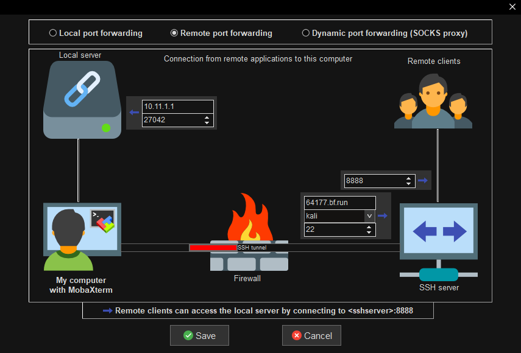
    
4. Save and start the tunnel
5. In the Kali box create and start a virtual environment. Then install Frida and Objection:
    
    ```bash
    $ virtualenv -p python3 frida
    $ source frida/bin/activate
    $ pip install frida-tools
    $ pip install -U objection
    ```
    
6. Now you can list the processes running in the iOS device:
    
    ```bash
    $ frida-ps -H 127.0.0.1:8888
    PID  Name
    -----  -------------------------------------------------
    130  ACCHWComponentAuthService
    553  AppSSODaemon
    75   AppleCredentialManagerDaemon
    533  AssetCacheLocatorService
    168  BlueTool
    5094 CAReportingService
    529  CMFSyncAgent
    1400 CacheDeleteAppContainerCaches
    1403 CacheDeleteExtension
    3829 CalendarWidgetExtension
    197  CallHistorySyncHelper
    ```
    
7. You can also list the installed applications with the following command:
    
    ```bash
    $ frida-ps -iaH 127.0.0.1:8888
    ```
    
8. Start an application with objection using the following command:
    
    ```bash
    $ objection -N -h 127.0.0.1 -p 8888 -g com.apple.testapp explore
    ```
    

Finally, in order to install ad-hoc signed, fakesigned, or unsigned IPA app packages on the device we will need Appsync Unified to automatically sign the installed applications

1. In the iOS device open the Cydia ************application and tap on *Sources > Edit > Add.* Type `https://cydia.akemi.ai`. Tap on ****************Add source.**************** Repeat the process if the Cydia ************application throws a ****************Request timeout**************** error
    
    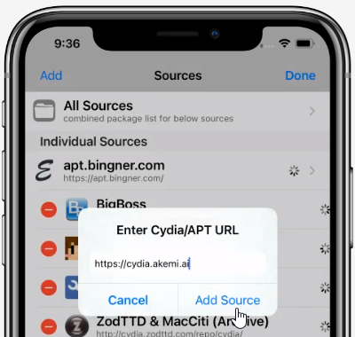
    
2. Tap on ****************Return to cydia**************** and then go to *Search* and type *******Appsync Unified.******* Choose *****Appsync Unified > Install > Confirm > Restart SpringBoard*****
    
    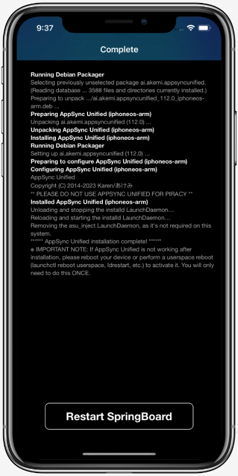
    

## Setup 2 - iOS Device In Corellium + Frida & Objection In WSL + Burp In Local Windows + Routing Through Kali Box

### Configuration Diagram

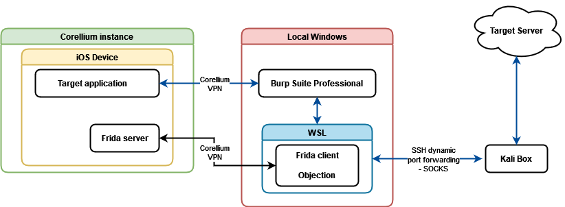

This setup is simpler since we will use the Kali box only to route the network traffic. In other words we will only need one SSH tunnel because the interaction between Frida, Objection and the iOS device will be managed through the Corellium VPN.

In this setup option we will have three main components: the Corellium instance, our local Windows host and a WSL distribution. The Corellium instance will host an iOS device that contains the target application and the Frida server. In the local Windows we will be running the Burp proxy to intercept the application’s traffic and WSL to execute the Frida client and Objection. We will also establish an SSH dynamic tunnel in WSL to the Kali box. The Kali box will route all the traffic to the target’s backend in the Internet.

>💡 **Note:** For this setup, WSL should be configured as version 1. WSL 1 will allow us to interact with the native Windows network interfaces from our Linux distribution

>💡 **Note:** Ubuntu 20.04.5 LTS is strongly recommended as WSL distribution

### Configuration Steps

1. Create a new iOS device in your Corellium instance and select `iPhone 11 Pro Max`, version `14.2 (Build 18B92)`

Corellium will take a few minutes to complete the creation of the new device. Meanwhile we can start configuring our proxy

1. Create/open a typical Burp project
2. Create new proxy listener for the iOS device. In the Burp *Proxy* tab click on *Proxy Settings > Proxy Listeners > Add* and add the following listener:
    - `Bind port: 8082`
    - Mark the `All interfaces` check box
    
    
    
3. Since the client has to be able to identify our network traffic, we have to route the Burp traffic to the application’s backend through the Kali box. In the Burp *Settings* window click on *Network > Connections > SOCKS proxy* and add the following proxy:
    - `SOCKS proxy host: 127.0.0.1`
    - `SOCKS proxy port: 9090`
    - Mark the `Use SOCKS proxy` check box
    
    
    
4. Open a new WSL tab and start an SSH tunnel for the Burp traffic in the Kali box using the following command:
    
    ```bash
    $ ssh -i <Path to your SSH private key for Kali boxes>/id_rsa -D 9090 -N -o ControlPath=/tmp/mysshcontrolpath kali@<Your Kali box address>.bf.run -v
    ```
    
    For example:
    
    ```bash
    $ ssh -i ~/.ssh/kaliboxes/id_rsa -D 9090 -N -o ControlPath=/tmp/mysshcontrolpath kali@64177.bf.run -v
    OpenSSH_8.2p1 Ubuntu-4ubuntu0.5, OpenSSL 1.1.1f  31 Mar 2020
    debug1: Reading configuration data /etc/ssh/ssh_config
    debug1: /etc/ssh/ssh_config line 19: include /etc/ssh/ssh_config.d/*.conf matched no files
    debug1: /etc/ssh/ssh_config line 21: Applying options for *
    debug1: Control socket "/tmp/mysshcontrolpath" does not exist
    debug1: Connecting to 64177.bf.run [64.52.111.183] port 22.
    debug1: Connection established.
    ...
    debug1: Authentications that can continue: publickey
    debug1: Next authentication method: publickey
    debug1: Trying private key: /home/ssantiago/.ssh/kaliboxes/id_rsa
    Enter passphrase for key '/home/ssantiago/.ssh/kaliboxes/id_rsa':
    debug1: Authentication succeeded (publickey).
    Authenticated to 64177.bf.run ([64.52.111.183]:22).
    debug1: Local connections to LOCALHOST:9090 forwarded to remote address socks:0
    debug1: Local forwarding listening on ::1 port 9090.
    debug1: channel 0: new [port listener]
    debug1: Local forwarding listening on 127.0.0.1 port 9090.
    debug1: channel 1: new [port listener]
    debug1: Requesting no-more-sessions@openssh.com
    debug1: Entering interactive session.
    debug1: pledge: network
    debug1: client_input_global_request: rtype hostkeys-00@openssh.com want_reply 0
    debug1: Remote: /home/kali/.ssh/authorized_keys:2: key options: agent-forwarding port-forwarding pty user-rc x11-forwarding
    ```
    
5. Once the iOS device is created and running. Go to the Corellium ********Connect******** section and download the *****OVPN file*****
    
    
    
6. Import the *****OVPN file***** in OpenVPN and connect to the Corellium VPN profile
    
    
    
7. Open a CMD window and type `ipconfig` to obtain the IP address of your local Windows host within the Corellium VPN range. It must be something like `10.11.3.2`
    
    
    
    You can also execute `ipconfig` from WSL specifying the complete path of the binary:
    
    ```bash
    $ /mnt/c/Windows/System32/ipconfig.exe
    Windows IP Configuration
    
    Ethernet adapter Ethernet:
    
       Media State . . . . . . . . . . . : Media disconnected
       Connection-specific DNS Suffix  . :
    
    ...
    
    Unknown adapter OpenVPN TAP-Windows6:
    
       Connection-specific DNS Suffix  . :
       Link-local IPv6 Address . . . . . : fe80::4005:19b:90c6:a04f%3
       IPv4 Address. . . . . . . . . . . : 10.11.3.2
       Subnet Mask . . . . . . . . . . . : 255.255.252.0
       Default Gateway . . . . . . . . . :
    ...
    ```
    

1. In the iOS device go to ********************Settings > Wi-Fi >******************** tap on **i** icon of the Corellium network ***********> Configure > Proxy > Manual*********** and set the following parameters:
    - `Server: <IP address obtained in step 9>`
    - `Port: 8082`
    
    
    
    
    
2. Open the Safari browser in the iOS device and go to `http://burp`. Then tap on **********************CA Certificate > Allow**********************
    
    
    
3. Go to ********************************************************************************Settings > Profile Downloaded > PortSwigger CA > Install > Install > Install > Done********************************************************************************
    
    
    
4. Go to *Settings > General > About > Certificate Trust Settings > Enable PortSwiggerCA*. Now, the iOS device has internet access and the proxy configured
    
    
    

At this point we have configured Burp and the device proxy. You can test it by browsing `wikipedia.org` in Safari and intercepting the traffic in Burp. Now we have to configure Frida and the Kali box. By default, a Frida server is running in the port 27042 of the iOS device. However, we need to create a port forwarding entry in the Corellium’s console to enable network access.

1. In Corellium go to *Port Forwarding > Add Port* and create the following entry:
    - `Device port: 27042`
    - `Router port: 27042`
    
    
    
2. Grab the IP address of your iOS device in the Corellium ***************Connect > IP Connectiviy > Services IP*************** section
    
    
    
3. Create and start a virtual environment in WSL. Then install Frida and Objection:
    
    ```bash
    $ virtualenv -p python3 frida
    $ source frida/bin/activate
    $ pip install frida-tools
    $ pip install -U objection
    ```
    
4. Now you can list the processes running in the iOS device specifying the IP address obtained in step 14, for example `10.11.1.1`:
    
    ```bash
    $ frida-ps -H 10.11.1.1:27042
    PID  Name
    ----  -----------------------------------------------
    1204  Phone
     928  Settings
     255  adbd
     497  android.hardware.audio@2.0-service
     498  android.hardware.camera.provider@2.4-service
     499  android.hardware.cas@1.0-service
     500  android.hardware.configstore@1.1-service
     501  android.hardware.drm@1.0-service
     502  android.hardware.gnss@1.0-service
     503  android.hardware.graphics.allocator@2.0-service
     504  android.hardware.graphics.composer@2.1-service
    ...
    ```
    
5. You can also list the installed applications with the following command:
    
    ```bash
    $ frida-ps -iaH 10.11.1.1:27042
    ```
    
6. Start an application with objection using the following command:
    
    ```bash
    $ objection -N -h 10.11.1.1 -p 27042 -g com.apple.testapp explore
    ```
    

Finally, in order to install ad-hoc signed, fakesigned, or unsigned IPA app packages on the device we will need Appsync Unified to automatically sign the installed applications

1. In the iOS device open the Cydia ************application and tap on *Sources > Edit > Add.* Type `https://cydia.akemi.ai`. Tap on ****************Add source.**************** Repeat the process if the Cydia ************application throws a ****************Request timeout**************** error
    
    
    
2. Tap on ****************Return to cydia**************** and then go to *Search* and type *******Appsync Unified.******* Choose *****Appsync Unified > Install > Confirm > Restart SpringBoard*****
    
    
    

# Android

## Setup 1 - Android Device In Genymotion + Frida & Objection In Kali Box + Burp & MobaXterm In Local Windows

### Configuration Diagram

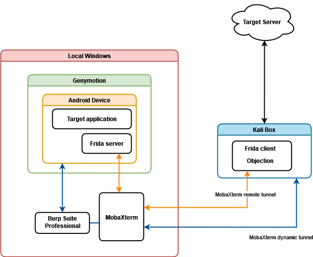

In this setup option we will have two main components: our local Windows host and the Kali box. Genymotion, Burp and MobaXterm will be running in our local Windows. An Android VM will be created with Genymotion that will host the target application and the Frida server necessary for some actions such as bypassing SSL pinning and extracting the memory dump. Burp Suite proxy will intercept the application’s traffic and MobaXterm will establish SSH tunnels to and from the Kali box. Finally, the Kali box will route all the traffic to the target’s backend in the Internet and also will host the Frida client and Objection to interact with the Android device.

Two SSH tunnels between our Windows host and the Kali box will be needed; one for the communication between the application, Burp and the Kali box and the other one for the communication between Frida’s server and client.

### Configuration Steps

1. Open Genymotion and click on the ****+**** button to create a new virtual device. Select a device model of your choice (Samsung Galaxy S10 recommended), click on **********NEXT**********, name your device and select the Android API version according to your project requirements (i.e. minimum Android API version supported by the target application). Click ****Next**** several times and then click *******Install*******
    
    
    

While the virtual device is being created we can start configuring our proxy

1. Create/open a typical Burp project
2. Create new proxy listener for the iOS device. In the Burp *Proxy* tab click on *Proxy Settings > Proxy Listeners > Add* and add the following listener:
    - `Bind port: 8082`
    - Mark the `All interfaces` check box
    
    
    
3. Since the client has to be able to identify our network traffic, we have to route the Burp traffic to the application’s backend through the Kali box. In the Burp *Settings* window click on *Network > Connections > SOCKS proxy* and add the following proxy:
    - `SOCKS proxy host: 127.0.0.1`
    - `SOCKS proxy port: 9090`
    - Mark the `Use SOCKS proxy` check box
    
    
    
4. Open MobaXterm and create a new SSH tunnel for the Burp traffic in the Kali box. Click on *Tunneling > New SSH tunnel > Dynamic Port Forwarding (SOCKS Proxy)* and set the following parameters:
    - `Forwarded port: 9090`
    - `SSH server: <Your Kali box address>.bf.run`
    - `SSH login: kali`
    - `SSH port: 22`
    
    
    
5. Save and start the tunnel
6. Start the new Android device when the creation process is finished
7. In Burp, go to the Burp *Proxy* tab and click on *Proxy Settings.* Then click on *********************************************************************Import /export CA certificate > Export > Certificate in DER format >********************************************************************* Choose a path and name it anything with a *****.cer***** extension (for example `cacert.cer`) > click on ****Next****
    
    
    
8. Move/upload the exported certificate to the Kali box, then convert the Burp certificate to PEM format and get the `subject_hash_old` with the following commands:
    
    ```bash
    $ openssl x509 -inform DER -in cacert.cer -out cacert.pem
    $ openssl x509 -inform PEM -subject_hash_old -in cacert.pem |head -1
    ```
    
9. Rename the PEM file with the output hash from the last command (for example `9a5ba575`) and add `.0` at the end:
    
    ```bash
    $ mv cacert.pem 9a5ba575.0
    ```
    
10. Move/download the `.0` file from your Kali box
11. Open a CMD window and go to the Genymotion installation folder. For example `C:\Program Files\Genymobile\Genymotion\` and then go to the `tools` folder to use the `adb.exe` binary included with Genymotion
    
    ```powershell
    cd "C:\Program Files\Genymobile\Genymotion\tools"
    ```
    
12. Upload the `.0` file to the Android device and install it:
    
    ```powershell
    adb.exe remount
    adb.exe push <.0 file location>/9a5ba575.0 /system/etc/security/cacerts/
    adb.exe shell "chmod 644 /system/etc/security/cacerts/9a5ba575.0"
    ```
    
13. Reboot the Android device
14. After the device reboots go to ******************************************Settings > Security > Trusted Credentials****************************************** and verify that the *Portswigger CA* is installed as a system trusted CA
    
    
    
15. In the CMD window type `ipconfig` to obtain the IP address of your local Windows host in the VirtualBox Host-Only network, for example `192.168.174.2`
    
    
    
16. In the CMD window at the Genymotion `tools` folder enter the next command to configure the proxy in the Android device:
    
    ```powershell
    adb.exe shell "settings put global http_proxy <IP address obtained in step 16>:8082"
    ```
    
    For example:
    
    ```powershell
    adb.exe shell "settings put global http_proxy 192.168.174.2:8082"
    ```
    
    >💡 **Note:** You can disable the proxy using the following command: `adb.exe shell settings put global http_proxy :0`. You can also check the status of the proxy with `adb.exe shell settings get global http_proxy`
    

At this point we have configured Burp and the device proxy. You can test it by browsing `wikipedia.org` in the default WebView Browser and intercepting the traffic in Burp. Now we have to configure Frida and the Kali box. We also need to create a second SSH tunnel to communicate our Kali box with the Frida server

1. In the CMD window at the Genymotion `tools` folder get the device architecture with the following command:
    
    ```powershell
    adb.exe shell "getprop ro.product.cpu.abi"
    ```
    
2. Go to [https://github.com/frida/frida/releases](https://github.com/frida/frida/releases) and download the Frida server package for Android corresponding to your device architecture. For example, if the architecture is `x86` you should download the package `frida-server-16.1.1-android-x86.xz`
3. Extract the file, upload it to your device and give it execution permission:
    
    ```powershell
    adb.exe push <Extracted file location>/frida-server-16.1.1-android-x86 /data/local/tmp/
    adb.exe shell "chmod 755 /data/local/tmp/frida-server-16.1.1-android-x86"
    ```
    
4. Start an `adb` shell and execute the Frida server in the background listening for connections from any IP address in the port 9999:
    
    ```bash
    adb.exe shell
    vbox86p:/ # cd /data/local/tmp/
    vbox86p:/ # ./frida-server-16.1.1-android-x86 -l 0.0.0.0:9999 &
    ```
    
5. Get the IP address of your virtual device with the following command. Generally, the *****eth0***** interface is the one that we need:
    
    ```bash
    vbox86p:/ # ifconfig
    ...
    eth0      Link encap:Ethernet  HWaddr 08:00:27:fe:15:55  Driver virtio_net
              inet addr:192.168.174.108  Bcast:192.168.174.255  Mask:255.255.255.0
              inet6 addr: fe80::a00:27ff:fefe:1555/64 Scope: Link
              UP BROADCAST RUNNING MULTICAST  MTU:1500  Metric:1
              RX packets:47461 errors:0 dropped:0 overruns:0 frame:0
              TX packets:13124 errors:0 dropped:0 overruns:0 carrier:0
              collisions:0 txqueuelen:1000
              RX bytes:54313445 TX bytes:19129794
    ```
    
6. In MobaXterm click on *Tunneling > New SSH tunnel > Remote Port Forwarding* and configure the following tunnel:
    - `Forwarded port: 8888`
    - `SSH server: <Your Kali box address>.bf.run`
    - `SSH login: kali`
    - `SSH port: 22`
    - `Local server: <IP address of your Genymotion device. Step 22>`
    - `Local port: 9999`
    
    
    
7. Save and start the tunnel
8. In the Kali box create and start a virtual environment. Then install Frida and Objection:
    
    ```bash
    $ virtualenv -p python3 frida
    $ source frida/bin/activate
    $ pip install frida-tools
    $ pip install -U objection
    ```
    
9. Now you can list the processes running in the Android device:
    
    ```bash
    $ frida-ps -H 127.0.0.1:8888
    PID  Name
    ----  -----------------------------------------------
    1204  Phone
     928  Settings
     255  adbd
     497  android.hardware.audio@2.0-service
     498  android.hardware.camera.provider@2.4-service
     499  android.hardware.cas@1.0-service
     500  android.hardware.configstore@1.1-service
     501  android.hardware.drm@1.0-service
     502  android.hardware.gnss@1.0-service
     503  android.hardware.graphics.allocator@2.0-service
     504  android.hardware.graphics.composer@2.1-service
    ...
    ```
    
10. You can also list the installed applications with the following command:
    
    ```bash
    $ frida-ps -iaH 127.0.0.1:8888
    ```
    
11. Start an application with objection using the following command:
    
    ```bash
    $ objection -N -h 127.0.0.1 -p 8888 -g com.android.testapp explore
    ```
    

If the target application is only available for ARM architecture we will need to install the ARM translation libraries since the Genymotion devices’ architecture is x86 and x86_64

>💡 **Note:** At the time this playbook is written, the latest Android version supported by the translation libraries is Android 9 - API 28

1. Go to [https://github.com/m9rco/Genymotion_ARM_Translation](https://github.com/m9rco/Genymotion_ARM_Translation) and download the package corresponding to your device Android version
    
    
    
2. Drag and drop the package into the Genymotion device directly
    
    
    
3. Tap on **OK**
    
    
    
4. After successful installation, restart the device

Another useful feature in Genymotion is OpenGAPPs to enable the Google services in the virtual device. This will allow you to sign in to Google accounts, install applications from Play Store, etc.

>💡 **Note:** OpenGAPPs must be installed after the ARM translation tools

1. In the Genymotion device window click on the *********OpenGAPPs********* button
    
    
    
2. Click on *******Accept > Restart now*******

The Play Store application will be available

## Setup 2 - Android Device In Genymotion + Frida & Objection In WSL + Burp In Local Windows + Routing Through Kali Box

### Configuration Diagram

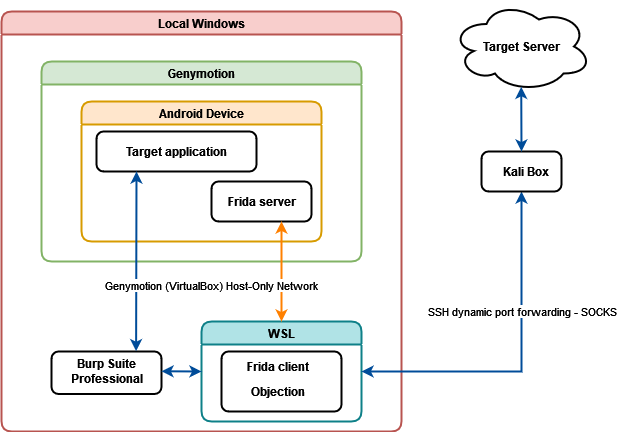

This setup is simpler since we will use the Kali box only to route the network traffic. In other words we will only need one SSH tunnel because the interaction between Frida, Objection and the Android device will be managed locally. 

In this setup option we will have three main components: our local Windows host, a WSL distribution and the Kali box. Genymotion, Burp and WSL will be running in our local Windows. An Android VM will be created with Genymotion that will host the target application and the Frida server necessary for some actions such as bypassing SSL pinning and extracting the memory dump. Burp Suite proxy will intercept the application’s traffic and an SSH tunnel will be established to the Kali box using WSL. Frida client and Objection will be executed from WSL as well. Finally, the Kali box will route all the traffic to the target’s backend in the Internet.

>💡 **Note:** For this setup, WSL should be configured as version 1. WSL 1 will allow us to interact with the native Windows network interfaces from our Linux distribution

>💡 **Note:** Ubuntu 20.04.5 LTS is strongly recommended as WSL distribution

### Configuration Steps

1. Open Genymotion and click on the ****+**** button to create a new virtual device. Select a device model of your choice (Samsung Galaxy S10 recommended), click on **********NEXT**********, name your device and select the Android API version according to your project requirements (i.e. minimum Android API version supported by the target application). Click ****Next**** several times and then click *******Install*******
    
    
    

While the virtual device is being created we can start configuring our proxy

1. Create/open a typical Burp project
2. Create new proxy listener for the iOS device. In the Burp *Proxy* tab click on *Proxy Settings > Proxy Listeners > Add* and add the following listener:
    - `Bind port: 8082`
    - Mark the `All interfaces` check box
    
    
    
3. Since the client has to be able to identify our network traffic, we have to route the Burp traffic to the application’s backend through the Kali box. In the Burp *Settings* window click on *Network > Connections > SOCKS proxy* and add the following proxy:
    - `SOCKS proxy host: 127.0.0.1`
    - `SOCKS proxy port: 9090`
    - Mark the `Use SOCKS proxy` check box
    
    
    
4. Open a new WSL tab and start an SSH tunnel for the Burp traffic in the Kali box using the following command:
    
    ```bash
    $ ssh -i <Path to your SSH private key for Kali boxes>/id_rsa -D 9090 -N -o ControlPath=/tmp/mysshcontrolpath kali@<Your Kali box address>.bf.run -v
    ```
    
    For example:
    
    ```bash
    $ ssh -i ~/.ssh/kaliboxes/id_rsa -D 9090 -N -o ControlPath=/tmp/mysshcontrolpath kali@64177.bf.run -v
    OpenSSH_8.2p1 Ubuntu-4ubuntu0.5, OpenSSL 1.1.1f  31 Mar 2020
    debug1: Reading configuration data /etc/ssh/ssh_config
    debug1: /etc/ssh/ssh_config line 19: include /etc/ssh/ssh_config.d/*.conf matched no files
    debug1: /etc/ssh/ssh_config line 21: Applying options for *
    debug1: Control socket "/tmp/mysshcontrolpath" does not exist
    debug1: Connecting to 64177.bf.run [64.52.111.183] port 22.
    debug1: Connection established.
    ...
    debug1: Authentications that can continue: publickey
    debug1: Next authentication method: publickey
    debug1: Trying private key: /home/ssantiago/.ssh/kaliboxes/id_rsa
    Enter passphrase for key '/home/ssantiago/.ssh/kaliboxes/id_rsa':
    debug1: Authentication succeeded (publickey).
    Authenticated to 64177.bf.run ([64.52.111.183]:22).
    debug1: Local connections to LOCALHOST:9090 forwarded to remote address socks:0
    debug1: Local forwarding listening on ::1 port 9090.
    debug1: channel 0: new [port listener]
    debug1: Local forwarding listening on 127.0.0.1 port 9090.
    debug1: channel 1: new [port listener]
    debug1: Requesting no-more-sessions@openssh.com
    debug1: Entering interactive session.
    debug1: pledge: network
    debug1: client_input_global_request: rtype hostkeys-00@openssh.com want_reply 0
    debug1: Remote: /home/kali/.ssh/authorized_keys:2: key options: agent-forwarding port-forwarding pty user-rc x11-forwarding
    ```
    
5. Start the new Android device when the creation process is finished
6. In Burp, go to the Burp *Proxy* tab and click on *Proxy Settings.* Then click on *********************************************************************Import /export CA certificate > Export > Certificate in DER format >********************************************************************* Choose a path and name it anything with a *****.cer***** extension (for example `cacert.cer`) > click on ****Next****
    
    
    
7. Open a new WSL tab and move the exported certificate to some location in WSL. You can access to the Windows file system through the WSL directory `/mnt/c/`:
    
    ```bash
    $ cp /mnt/c/Users/ssantiago/Downloads/cacert.cer .
    ```
    
    Then convert the Burp certificate to PEM format and get the `subject_hash_old` with the following commands:
    
    ```bash
    $ openssl x509 -inform DER -in cacert.cer -out cacert.pem
    $ openssl x509 -inform PEM -subject_hash_old -in cacert.pem |head -1
    ```
    
8. Rename the PEM file with the output hash from the last command (for example `9a5ba575`) and add `.0` at the end:
    
    ```bash
    $ mv cacert.pem 9a5ba575.0
    ```
    
9. Locate your Genymotion installation folder in Windows, it should be something like `C:\Program Files\Genymobile\Genymotion\`. Inside that folder there should be another folder named `tools` that contains the `adb.exe` binary we need
    
    ```bash
    $ ls -la /mnt/c/Program\ Files/Genymobile/Genymotion/tools/adb.exe
    -r-xr-xr-x 1 ssantiago ssantiago 17880576 Apr 15  2021 '/mnt/c/Program Files/Genymobile/Genymotion/tools/adb.exe'
    ```
    
10. Create a temporary or permanent Linux alias for `adb.exe` so we can execute it directly from WSL:
    
    ```bash
    # Temporary
    $ alias adb='"/mnt/c/Program Files/Genymobile/Genymotion/tools/adb.exe"'
    # Permanent
    $ echo alias adb=\'\"/mnt/c/Program Files/Genymobile/Genymotion/tools/adb.exe\"\' >> ~/.bashrc
    ```
    
11. Verify that `adb` is being executed properly:
    
    ```bash
    $ adb shell id
    uid=0(root) gid=0(root) groups=0(root),1004(input),1007(log),1011(adb),1015(sdcard_rw),1028(sdcard_r),3001(net_bt_admin),3002(net_bt),3003(inet),3006(net_bw_stats),3009(readproc),3011(uhid) context=u:r:su:s0
    ```
    
12. Upload the `.0` file to the Android device and install it with the following commands:
    
    ```bash
    $ adb remount
    $ adb 9a5ba575.0 /system/etc/security/cacerts/
    $ adb shell "chmod 644 /system/etc/security/cacerts/9a5ba575.0"
    ```
    
13. Reboot the Android device
14. After the device reboots go to ******************************************Settings > Security > Trusted Credentials****************************************** and verify that the *Portswigger CA* is installed as a system trusted CA
    
    
    
15. In a CMD window type `ipconfig` to obtain the IP address of your local Windows host in the VirtualBox Host-Only network, for example `192.168.174.2`
    
    
    
    You can also execute `ipconfig` from WSL specifying the complete path of the binary:
    
    ```bash
    $ /mnt/c/Windows/System32/ipconfig.exe
    Windows IP Configuration
    
    Ethernet adapter Ethernet:
    
       Media State . . . . . . . . . . . : Media disconnected
       Connection-specific DNS Suffix  . :
    
    ...
    
    Ethernet adapter VirtualBox Host-Only Network:
    
       Connection-specific DNS Suffix  . :
       Link-local IPv6 Address . . . . . : fe80::d051:529e:efe3:cede%20
       IPv4 Address. . . . . . . . . . . : 192.168.174.2
       Subnet Mask . . . . . . . . . . . : 255.255.255.0
    ```
    
16. In WSL enter the next command to configure the proxy in the Android device:
    
    ```bash
    $ adb shell "settings put global http_proxy <IP address obtained in step 16>:8082"
    ```
    
    For example:
    
    ```bash
    $ adb shell "settings put global http_proxy 192.168.174.2:8082"
    ```
    
    >💡 **Note:** You can disable the proxy using the following command: `adb shell settings put global http_proxy :0`. You can also check the status of the proxy with `adb shell settings get global http_proxy`
    

At this point we have configured Burp and the device proxy. You can test it by browsing `wikipedia.org` in the default WebView Browser and intercepting the traffic in Burp. Now we have to configure Frida and Objection to communicate to the Android device

1. In the WSL tab get the device architecture with the following command:
    
    ```bash
    $ adb shell "getprop ro.product.cpu.abi"
    ```
    
2. Go to [https://github.com/frida/frida/releases](https://github.com/frida/frida/releases) and download the Frida server package for Android corresponding to your device architecture. For example, if the architecture is `x86` you should download the package `frida-server-16.1.1-android-x86.xz`
3. Extract the file, upload it to your device and give it execution permission:
    
    ```bash
    $ wget https://github.com/frida/frida/releases/download/16.1.1/frida-server-16.1.1-android-x86.xz
    $ unxz frida-server-16.1.1-android-x86.xz
    $ adb push frida-server-16.1.1-android-x86 /data/local/tmp/
    $ adb shell "chmod 755 /data/local/tmp/frida-server-16.1.1-android-x86"
    ```
    
4. Start an `adb` shell and execute the Frida server in the background listening for connections from any IP address in the port 9999:
    
    ```bash
    $ adb.exe shell
    vbox86p:/ # cd /data/local/tmp/
    vbox86p:/ # ./frida-server-16.1.1-android-x86 -l 0.0.0.0:9999 &
    ```
    
5. Get the IP address of your virtual device and exit with the following commands. Generally, the *****eth0***** interface is the one that we need:
    
    ```bash
    vbox86p:/ # ifconfig
    ...
    eth0      Link encap:Ethernet  HWaddr 08:00:27:fe:15:55  Driver virtio_net
              inet addr:192.168.174.108  Bcast:192.168.174.255  Mask:255.255.255.0
              inet6 addr: fe80::a00:27ff:fefe:1555/64 Scope: Link
              UP BROADCAST RUNNING MULTICAST  MTU:1500  Metric:1
              RX packets:47461 errors:0 dropped:0 overruns:0 frame:0
              TX packets:13124 errors:0 dropped:0 overruns:0 carrier:0
              collisions:0 txqueuelen:1000
              RX bytes:54313445 TX bytes:19129794
    vbox86p:/ # exit
    ```
    
6. Create and start a virtual environment in WSL. Then install Frida and Objection:
    
    ```bash
    $ virtualenv -p python3 frida
    $ source frida/bin/activate
    $ pip install frida-tools
    $ pip install -U objection
    ```
    
7. Now you can list the processes running in the Android device specifying the IP address of your Genymotion device obtained in step 22, for example `192.168.174.108`:
    
    ```bash
    $ frida-ps -H 192.168.174.108:9999
    PID  Name
    ----  -----------------------------------------------
    1204  Phone
     928  Settings
     255  adbd
     497  android.hardware.audio@2.0-service
     498  android.hardware.camera.provider@2.4-service
     499  android.hardware.cas@1.0-service
     500  android.hardware.configstore@1.1-service
     501  android.hardware.drm@1.0-service
     502  android.hardware.gnss@1.0-service
     503  android.hardware.graphics.allocator@2.0-service
     504  android.hardware.graphics.composer@2.1-service
    ...
    ```
    
8. You can also list the installed applications with the following command:
    
    ```bash
    $ frida-ps -iaH 192.168.174.108:9999
    ```
    
9. Start an application with objection using the following command:
    
    ```bash
    $ objection -N -h 192.168.174.108 -p 9999 -g com.android.testapp explore
    ```
    

If the target application is only available for ARM architecture we will need to install the ARM translation libraries since the Genymotion devices’ architecture is x86 and x86_64

>💡 **Note:** At the time this playbook is written, the latest Android version supported by the translation libraries is Android 9 - API 28

1. Go to [https://github.com/m9rco/Genymotion_ARM_Translation](https://github.com/m9rco/Genymotion_ARM_Translation) and download the package corresponding to your device Android version
    
    
    
2. Drag and drop the package into the Genymotion device directly
    
    
    
3. Tap on **OK**
    
    
    
4. After successful installation, restart the device

Another useful feature in Genymotion is OpenGAPPs to enable the Google services in the virtual device. This will allow you to sign in to Google accounts, install applications from Play Store, etc.

>💡 **Note:** OpenGAPPs must be installed after the ARM translation tools

1. In the Genymotion device window click on the *********OpenGAPPs********* button
    
    
    
2. Click on *******Accept > Restart now*******

The Play Store application will be available
